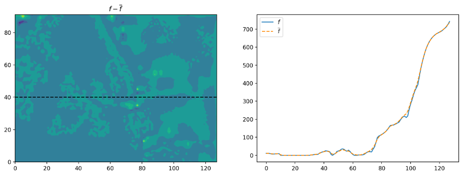

# SURF-SHYFEM Development

## Current State

- **Pre-processing :** 99.9%
- **Simulation :** 100% , using `version 7.5.0` :

    ```
    ----------------------------------------------

    SHYFEM - Finite Element Model for coastal seas
    Copyright (c) The Shyfem Team 1985-2015

    version: 7.5.0   
    routine: 3D FEM model

    ----------------------------------------------

    [...]

    program stop at time =    604800 seconds
    iterations =      12103
    NUMBER OF MPI THREADS USED  =            1
    NUMBER OF OMP THREADS USED  =            1
    TIME TO SOLUTION (WALL)     =    2011.6726238419999                0
    TIME TO SOLUTION (CPU)      =    2011.9556470000000                0
    TIMESTEPS TIME (WALL)     =    2010.2527838630001                0
    MPI_TIME =   2011.5478877119999                0
    Parallel_TIME =   2011.5478874109999                0
    ```

    - A stable simulation of 6 days on the madagascar domain could be performed without any crashes or errors. Here follows some visualizations of the final state of some the variables :

        **U-velocity :**

        
    
        **V-velocity :**

        

        **Temperature :**

        


- **Post-processing :** ~70%

  - Visualization of results on both **structured** and **unstructured** grid
    - **Structured :** uses same module already implemented for `surf_nemo`
    - **Unstructured :** based on [`matplotlib.tri.Triangulation`](https://matplotlib.org/stable/api/tri_api.html)

## Main developments

- ### [Mesh generation](https://github.com/CMCC-Foundation/surf_shyfem/pull/13)


  - Automatized generation and boundary extraction
  - Rounded open sea corners with Bezier curves
  - Transition from `sizemin` to `sizemax` as one approaches the open boundary

  

- ### [Structured to unstructured data interpolation](https://github.com/CMCC-Foundation/surf_shyfem/pull/17)


  
- ### [Write input files in shyfem readable format (`.dat`)](https://github.com/CMCC-Foundation/surf_shyfem/pull/19)

  `boundn_1.dat` :


  ```
  0 2 957839 41 1 1 1
  20210330 000000
  water level [m]
  1.3378153056773958
  1.3378885358461328
  1.3390002590041732
  1.339215317250322
  [...]
  ```
- ### [Bathymetry manipulation](https://github.com/CMCC-Foundation/surf_shyfem/pull/21)


  - Filtering (with Gaussian filter)

    
  - Interpolation (on element centroid locations)

    
  - Generation of 3d `.bas` file, as required by SHYFEM.

# Next steps

- Post-processing module
- Code freeze
- Documentation
